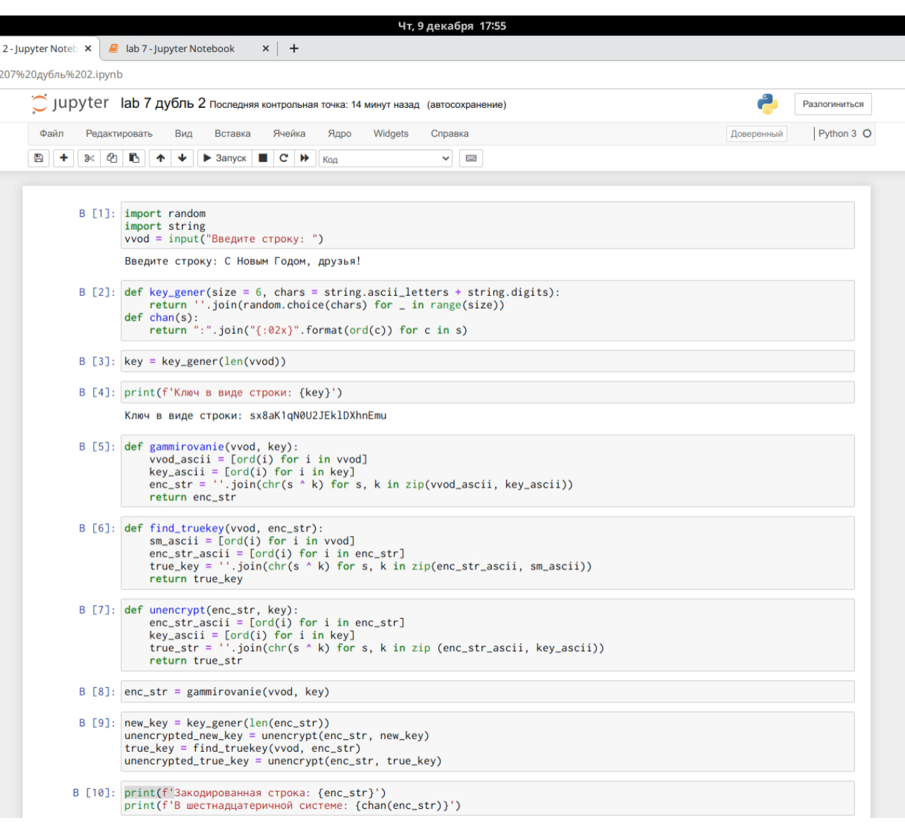
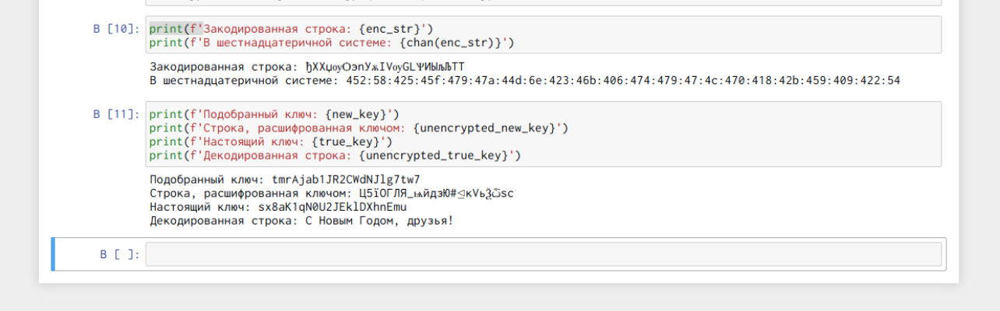

---
## Front matter
lang: ru-RU
title: Лабораторная работа №7. Элементы криптографии. Однократное гаммирование
author: Захарова Софья Михайловна

## Formatting
toc: false
slide_level: 2
##theme: metropolis
mainfont: PT Serif 
romanfont: PT Serif
sansfont: PT Sans
monofont: PT Mono
header-includes: 
## - '\metroset{progressbar=frametitle,sectionpage=progressbar,numbering=fraction}'
 - '\makeatletter'
## - '\beamer@ignorenonframefalse'
 - '\makeatother'
aspectratio: 43
section-titles: true
---
# Цель работы

Освоить на практике применение режима однократного гаммирования.

---
# Задание

Нужно подобрать ключ, чтобы получить сообщение «С Новым Годом, друзья!». Разработаем приложение, позволяющее шифровать и дешифровать данные в режиме однократного гаммирования.

---
# Выполнение лабораторной работы

1. Перейдем к написанию кода программы (рис.1).

{ #fig:001 width=50% }

---

2. Окончание программы, вывод (рис.2).

{ #fig:002 width=50% }

---

3. Ответы на контрольные вопросы: 
1) Поясните смысл однократного гаммирования.
Гаммирование – это наложение (снятие) на открытые (зашифрованные) данные криптографической гаммы, то есть последовательности элементов данных, вырабатываемых с помощью некоторого криптографического алгоритма, для получения зашифрованных (открытых) данных.
Однократное гаммирование – это когда каждый символ попарно с символом ключа складываются по модулю 2 (XOR).

---

4. 2) Перечислите недостатки однократного гаммирования.
Недостатки: Размер ключевого материала должен совпадать с размером передаваемых сообщений. Также необходимо иметь эффективные процедуры для выработки случайных равновероятных двоичных последовательностей и специальную службу для развоза огромного количества ключей. А ещё, если одну и ту же гамму использовать дважды для разных сообщений, то шифр из совершенно стойкого превращается в «совершенно нестойкий» и допускает дешифрование практически вручную.

---

5. 3) Перечислите преимущества однократного гаммирования. 
Достоинства: С точки зрения теории криптоанализа метод шифрования случайной однократной равновероятной гаммой той же длины, что и открытый текст, является невскрываемым. Кроме того, даже раскрыв часть сообщения, дешифровщик не сможет хоть сколько-нибудь поправить положение - информация о вскрытом участке гаммы не дает информации об остальных ее частях. К достоинствам также можно отнести простоту реализации и удобство применения.

---

6. 4) Почему длина открытого текста должна совпадать с длиной ключа?
Потому что каждый символ открытого текста должен складываться с символом ключа попарно.

---

7. 5) Какая операция используется в режиме однократного гаммирования, назовите её особенности?
В режиме однократного гаммирования используется сложение по модулю 2 (XOR) между элементами гаммы и элементами подлежащего сокрытию текста. Особенность заключается в том, что этот алгоритм шифрования является симметричным. Поскольку двойное прибавление одной и той же величины по модулю 2 восстанавливает исходное значение, шифрование и расшифрование выполняется одной и той же программой.

---

8. 6) Как по открытому тексту и ключу получить шифротекст?
Если известны ключ и открытый текст, то задача нахождения шифротекста заключается в применении к каждому символу открытого текста определенного правила. Размерности открытого текста и ключа должны совпадать, и полученный шифротекст будет такой же длины.

---

9. 7) Как по открытому тексту и шифротексту получить ключ?
Если известны шифротекст и открытый текст, то задача нахождения ключа решается также в соответствии с правилом, а именно, обе части равенства необходимо сложить по модулю 2

---

10. 8) В чем заключаются необходимые и достаточные условия абсолютной стойкости шифра?
Необходимые и достаточные условия абсолютной стойкости шифра:
 Полная случайность ключа;
 Равенство длин ключа и открытого текста;
 Однократное использование ключа.

---
# Выводы

В ходе выполнения лабораторной работы я изучила теорию и освоила на практике применение режима однократного гаммирования.

---

## {.standout}

Спасибо за внимание!
